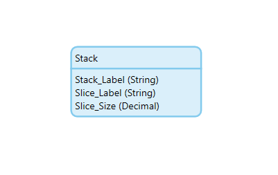
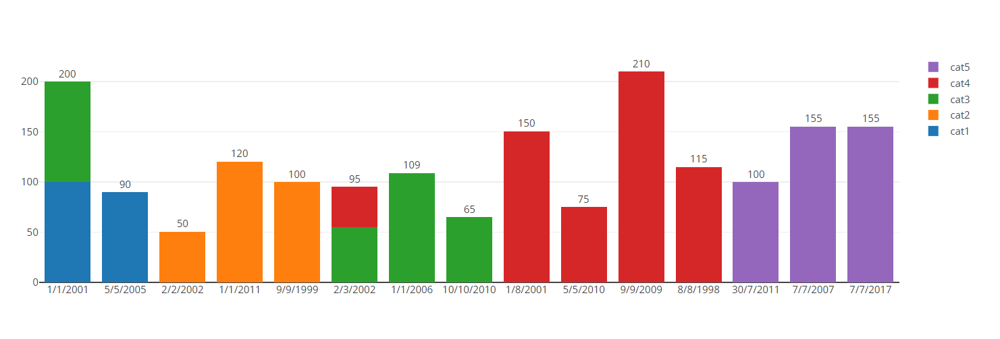

## Plotly Stacked Bar Chart
This widget purpose is to visualize the data in a stacked bar chart using plotly .

## Usage
Here is the domain model structure that should be pass from mendix to the pluggable widget , 
it could be from a microflow , or a datasource . 

## Demo project
Here we have the stack label which is the x label under each bar , and the slice size which is the y values , and slice label which is the series (cat1,cat2, ..... etc)

